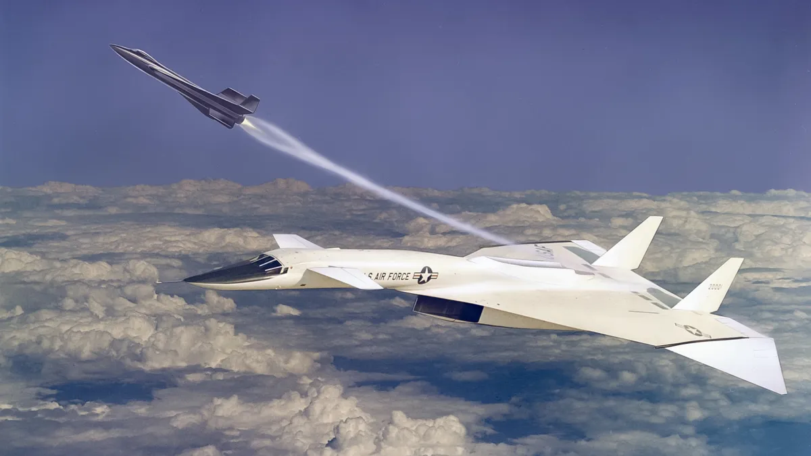

# Performance-Aware Programming ::  Homework Solutions

I'm following the [Performance-Aware Programming](https://www.computerenhance.com/p/table-of-contents) series by Casey Muratori. 

All original 8086 asm files found [here.](https://github.com/cmuratori/computer_enhance/tree/main/perfaware/part1) All solutions will be written in JAI. 

### Homework 1 :: Register to Register MOV
#### Lecture: [Instruction Decoding on the 8086](https://www.computerenhance.com/p/instruction-decoding-on-the-8086)
- ASM files were assembled using [nasm](https://www.nasm.us/).

### Homework 2 :: Immediate & Source Address MOVs
#### Lecture: [Decoding Multiple Instructions and Suffixes](https://www.computerenhance.com/p/decoding-multiple-instructions-and)
- WIP